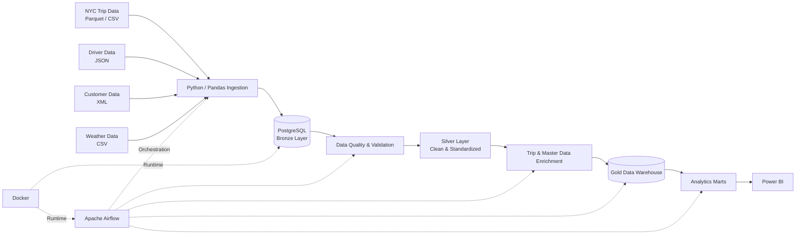
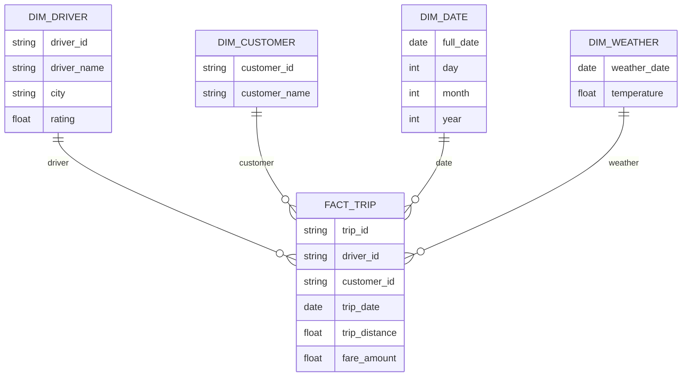
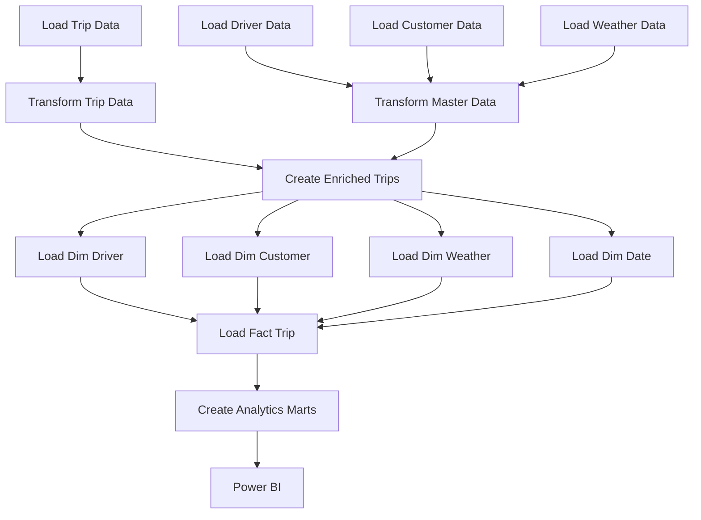

<div align="center">

# 🚕 Enterprise Uber Analytics Data Platform

### End-to-End Data Engineering • Medallion Architecture • Data Warehouse • Airflow • Docker • Power BI

**Designed & Developed by Vaidehi Doke**

[](https://www.python.org/)
[](https://www.postgresql.org/)
[](https://airflow.apache.org/)
[](https://www.docker.com/)
[](https://powerbi.microsoft.com/)

**Main Branch:**
`main`

**Advanced Architecture:**
[`incremental-loading`](https://github.com/Vaidu7972/Enterprise_uber_analytics/tree/incremental-loading)

</div>

---

## 📌 Project Overview

**Enterprise Uber Analytics** is an end-to-end Data Engineering and Business Intelligence platform designed to demonstrate how heterogeneous operational data can be transformed into a structured, governed and analytics-ready enterprise warehouse.

The platform implements a complete data lifecycle:

```text
Raw Data
   ↓
Data Ingestion
   ↓
Bronze Layer
   ↓
Data Quality & Validation
   ↓
Silver Layer
   ↓
Data Enrichment
   ↓
Gold Dimensional Warehouse
   ↓
Analytics Marts
   ↓
Power BI
```

The architecture separates **data acquisition, processing, quality, warehouse modelling and analytical consumption**, following patterns commonly used in enterprise data platforms.

---

# 🎯 Project Objectives

The project was designed to demonstrate practical implementation of:

* Multi-source data ingestion
* ETL / ELT pipelines
* Medallion Architecture
* Data quality validation
* Metadata tracking
* PostgreSQL data warehousing
* Dimensional modelling
* Fact and dimension tables
* Slowly Changing Dimensions
* Analytical marts
* Apache Airflow orchestration
* Docker containerization
* Business Intelligence using Power BI
* Modular Python data engineering
* Reproducible pipeline execution

---

# 🏗️ High-Level Architecture



---

# 🧱 Medallion Architecture

The project follows a **Bronze → Silver → Gold** architecture.

## 🥉 Bronze Layer — Raw Data

Purpose:

> Preserve source data close to its original representation while recording ingestion metadata.

Main entities include:

* `bronze.trip_raw`
* `bronze.driver_raw`
* `bronze.customer_raw`
* `bronze.weather_raw`

Metadata captured during ingestion includes:

```text
source_file
batch_id
load_timestamp
```

This provides basic traceability for where and when records entered the data platform.

---

## 🥈 Silver Layer — Trusted Data

The Silver layer converts raw data into standardized and reusable datasets.

Typical processing includes:

* Datatype conversion
* Missing-value handling
* Invalid-record filtering
* Standardization
* Deduplication
* Business-rule validation
* Date normalization
* Master-data preparation
* Trip enrichment

The purpose of Silver is to create a **trusted data layer independent of individual reporting requirements**.

---

## 🥇 Gold Layer — Business Data Warehouse

The Gold layer provides dimensional models optimized for analytics.

### Fact Table

```text
gold.fact_trip
```

### Dimensions

```text
gold.dim_driver
gold.dim_customer
gold.dim_weather
gold.dim_date
```

### Analytics Marts

```text
gold.revenue_mart
gold.driver_performance_mart
```

The Gold layer provides the shared analytical foundation consumed by Power BI and downstream analytical workloads.

---

# ⭐ Dimensional Model



The star-schema approach simplifies analytical queries and separates:

* **Business events** → Fact tables
* **Business context** → Dimension tables

---

# 📥 Data Sources

The platform demonstrates ingestion from multiple formats.

| Source              | Format  | Purpose               |
| ------------------- | ------- | --------------------- |
| NYC TLC Yellow Taxi | Parquet | Trip transactions     |
| Driver Dataset      | JSON    | Driver master data    |
| Customer Dataset    | XML     | Customer master data  |
| Weather Dataset     | CSV     | Environmental context |

The original baseline pipeline processed approximately:

* **2.69M trip records**
* **5,000 driver records**
* **5,000 customer records**
* **366 weather records**

This demonstrates handling of both large transactional datasets and smaller reference/master datasets.

---

# 🔄 End-to-End Pipeline Workflow



---

# ⚙️ Apache Airflow Orchestration

The complete pipeline is orchestrated through Apache Airflow.

### DAG

```text
enterprise_uber_analytics_pipeline
```

The DAG manages dependencies across:

1. Source ingestion
2. Trip transformation
3. Master-data transformation
4. Trip enrichment
5. Dimension loading
6. Fact-table loading
7. Analytics mart creation

This ensures that downstream processes execute only after their required upstream dependencies have completed.

---

# 🐳 Dockerized Runtime

Docker is used to provide a reproducible local runtime.

The architecture includes:

```text
Docker Desktop
      ↓
Docker Compose
      ↓
PostgreSQL
+
Airflow Metadata Database
+
Airflow Scheduler
+
Airflow Webserver
+
Python Pipeline Runtime
```

Benefits:

* Environment consistency
* Dependency isolation
* Reproducible setup
* Easier orchestration
* Portable development environment

---

# ✅ Data Quality

Data quality is treated as a pipeline stage rather than only a reporting concern.

The project includes:

* Validation scripts
* Null checks
* Datatype validation
* Missing-value handling
* Invalid-record handling
* Great Expectations project components
* Metadata capture
* Controlled transformation logic

Directory:

```text
gx/
scripts/validation/
```

---

# 🔁 Slowly Changing Dimensions

The repository also demonstrates Slowly Changing Dimension patterns.

```text
scripts/scd/
```

### SCD Type 1

Used when the latest state of an attribute should replace the previous value.

Example use case:

```text
Driver master information
```

### SCD Type 2

Used when historical changes need to remain available for point-in-time analysis.

Example use case:

```text
Customer dimension history
```

This demonstrates awareness of **historical dimensional modelling**, not just table loading.

---

# 📊 Analytics Layer

After Gold warehouse processing, reusable analytics marts support Business Intelligence.

## Executive Analytics

Examples:

* Total Revenue
* Total Trips
* Average Fare
* Average Distance
* Average Trip Duration
* Revenue Trend
* Weekend vs Weekday Analysis

## Revenue Analysis

* Daily revenue
* Trip volumes
* Revenue by weekday
* Revenue trends
* Daily business summaries

## Driver Performance

* Driver ratings
* Trips by driver
* Driver revenue contribution
* Driver rating vs revenue
* Driver performance comparison

---

# 📈 Power BI

The Power BI report connects to the PostgreSQL Gold layer and analytics marts.

Repository file:

```text
Uber_anallytics_dashboard.pbix
```

The dashboard demonstrates the complete journey:

```text
Operational Data
       ↓
Data Engineering
       ↓
Data Warehouse
       ↓
Analytical Model
       ↓
Business Intelligence
```

---

# 📁 Repository Structure

```text
Enterprise_uber_analytics/
│
├── airflow/
│   └── dags/
│       └── uber_pipeline_dag.py
│
├── agentic_ai/
│
├── config/
│
├── data/
│
├── docs/
│
├── gx/
│
├── scripts/
│   ├── ingestion/
│   ├── transformations/
│   ├── validation/
│   ├── warehouse/
│   ├── scd/
│   └── testing/
│
├── sql/
│
├── utils/
│
├── Dockerfile
├── docker-compose.yml
├── requirements.txt
├── requirements-docker.txt
├── complete queries of uber.sql
├── Uber_anallytics_dashboard.pbix
└── README.md
```

---

# 🛠️ Technology Stack

| Layer              | Technology                             |
| ------------------ | -------------------------------------- |
| Programming        | Python                                 |
| Data Processing    | Pandas                                 |
| Database           | PostgreSQL                             |
| Query Language     | SQL                                    |
| ORM / Connectivity | SQLAlchemy, psycopg2                   |
| File Formats       | Parquet, CSV, JSON, XML                |
| Data Quality       | Great Expectations + Python validation |
| Orchestration      | Apache Airflow                         |
| Containerization   | Docker, Docker Compose                 |
| Data Modelling     | Star Schema, Fact & Dimensions, SCD    |
| Analytics          | Power BI                               |
| Version Control    | Git, GitHub                            |
| Development        | VS Code                                |

---

# 🚀 Running the Project

## 1. Clone repository

```bash
git clone https://github.com/Vaidu7972/Enterprise_uber_analytics.git
cd Enterprise_uber_analytics
git checkout main
```

## 2. Install Python dependencies

```bash
pip install -r requirements.txt
```

## 3. Start Docker services

```bash
docker compose build
docker compose up -d
```

Check containers:

```bash
docker compose ps
```

## 4. Run the Airflow pipeline

From the Airflow UI, trigger:

```text
enterprise_uber_analytics_pipeline
```

## 5. Explore the analytical warehouse

PostgreSQL schemas:

```text
bronze
silver
gold
```

## 6. Open Power BI

Open:

```text
Uber_anallytics_dashboard.pbix
```

and connect it to the Gold warehouse if required.

## 7. Stop services

```bash
docker compose down
```

---

# 🧠 Key Architecture Decisions

### Why Bronze / Silver / Gold?

To separate:

```text
Source Fidelity
      ↓
Data Quality
      ↓
Business Consumption
```

This prevents BI-specific transformations from contaminating raw ingestion logic.

### Why PostgreSQL?

PostgreSQL provides:

* Relational integrity
* SQL analytics
* Schema isolation
* Dimensional modelling
* Simple local reproducibility

### Why Airflow?

Airflow makes dependencies explicit and turns independent Python scripts into an orchestrated data pipeline.

### Why Analytics Marts?

Analytics marts isolate business-facing calculations from the underlying transactional model and simplify BI consumption.

### Why Docker?

Docker allows the platform to run consistently across development environments.

---

# 🌿 Branch Strategy

This repository intentionally shows the evolution of the platform.

| Branch                | Focus                                                                                           |
| --------------------- | ----------------------------------------------------------------------------------------------- |
| `main`                | Core Data Engineering, Medallion Architecture, Data Warehouse, Airflow, Docker and Power BI     |
| `incremental-loading` | Advanced incremental processing, auditability, ML, RAG, Agentic AI and operational intelligence |

For the most advanced version of the project, explore:

👉 **[`incremental-loading`](https://github.com/Vaidu7972/Enterprise_uber_analytics/tree/incremental-loading)**

---

# 🚀 Architecture Evolution

The `main` branch establishes the trusted data foundation.

The next evolution extends this foundation toward:

```text
Batch Data Engineering
        ↓
Incremental Processing
        ↓
Operational Observability
        ↓
Predictive Machine Learning
        ↓
RAG
        ↓
Multi-Agent AI
        ↓
Governed Decision Intelligence
```

That architecture is implemented in the **`incremental-loading` branch**.

---

# 💡 What This Project Demonstrates

This project demonstrates more than loading files into a database.

It shows how to design an end-to-end data platform where:

* Raw data is preserved
* Transformations are modular
* Quality is explicitly checked
* Data is modelled for analytics
* Pipelines are orchestrated
* Runtime environments are reproducible
* BI consumes curated datasets
* Architecture can evolve without replacing its foundational data model

---

<div align="center">

## Enterprise Uber Analytics

**From Raw Mobility Data → Trusted Warehouse → Business Intelligence**

Built by **Vaidehi Doke**

⭐ Explore the advanced [`incremental-loading`](https://github.com/Vaidu7972/Enterprise_uber_analytics/tree/incremental-loading) branch for the complete UberOps AI architecture.

</div>
